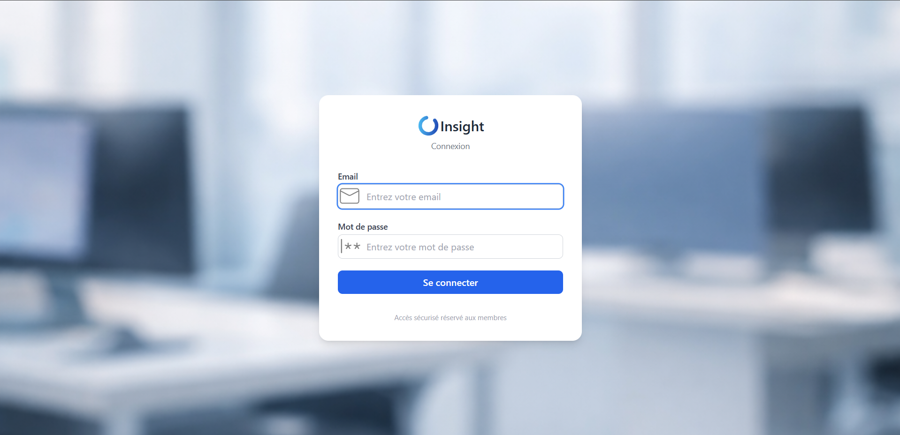
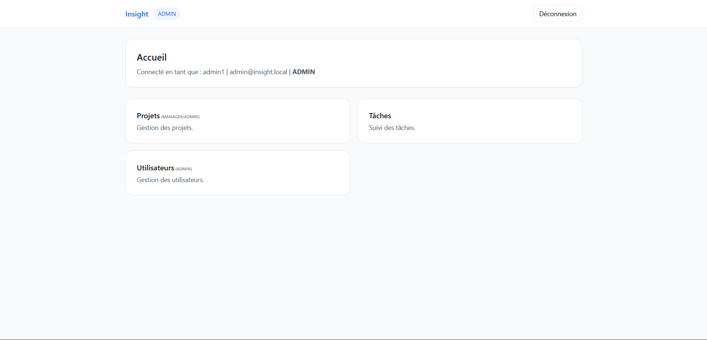
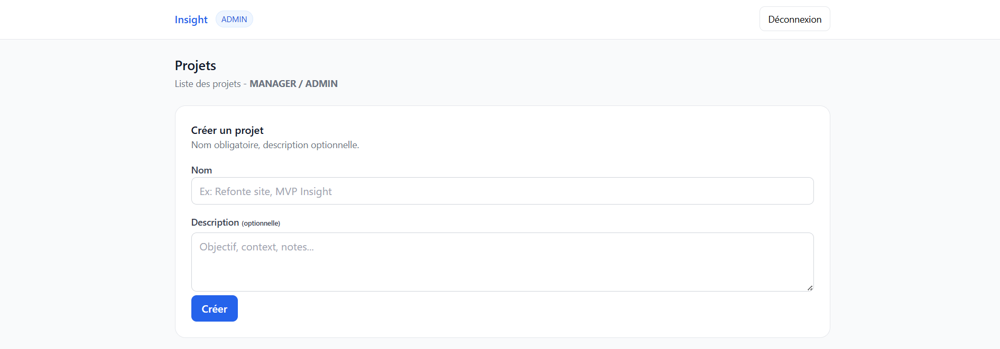
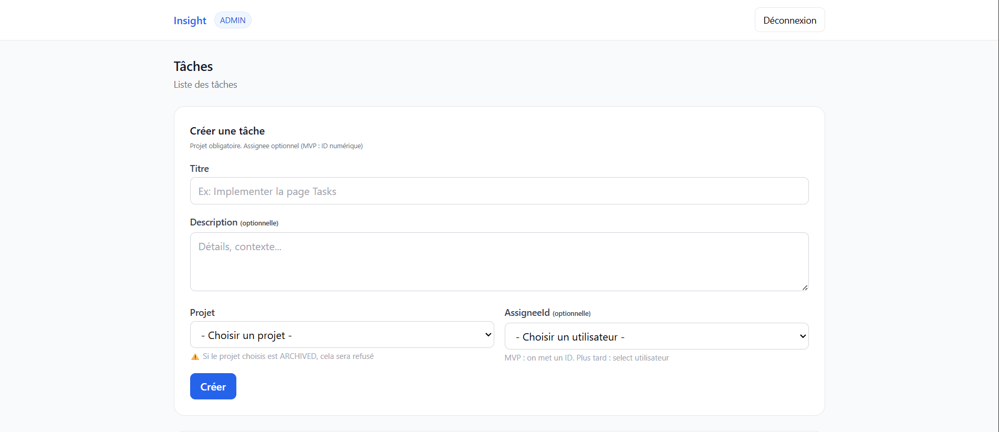
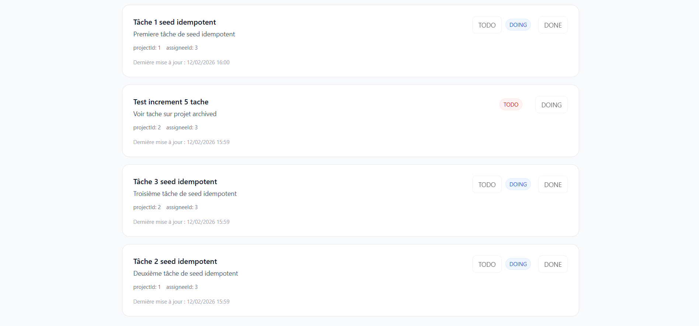
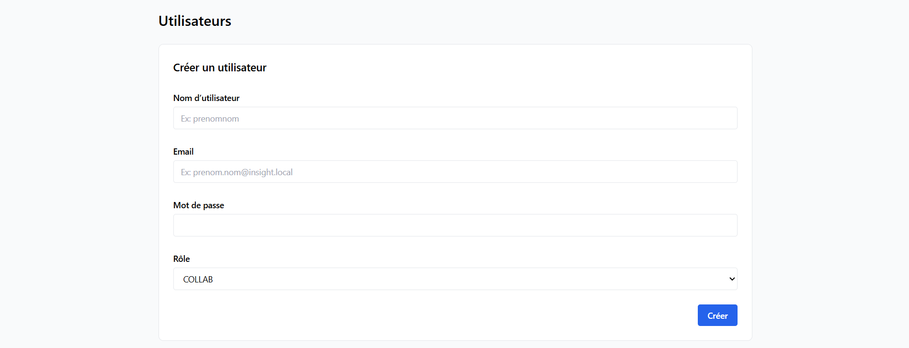
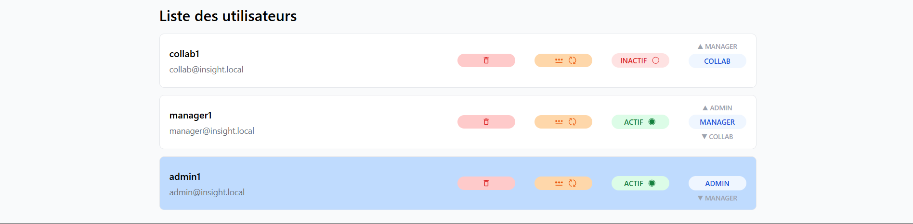

# Insight — MVP de Pilotage d’Activité

## 1. 🎯 Vision
Insight est un outil interne de pilotage d’activité conçu pour structurer la gestion des équipes, projets et tâches dans un contexte de croissance.

Il vise à :
- Centraliser l’information
- Clarifier les responsabilités
- Sécuriser les accès
- Accélérer la prise de décision

## 2. 🚨 Problématique
Dans de nombreuses équipes :
- Les informations sont dispersées
- L’avancement des projets manque de visibilité
- Les responsabilités sont floues
- Les décisions reposent sur des données incomplètes

Insight répond à ces problématiques via un MVP structuré, sécurisé et orienté valeur métier.

## 3. 🧱 Architecture
### Backend
- NestJS
- Prisma ORM
- MySQL
- JWT (Access 15min + Refresh 7j avec rotation)
- RBAC via Guards
- Validation DTO stricte

Responsabilités :
- Authentification
- Autorisation
- Application des règles métier
- Persistance des données

### Frontend
- React
- Vite
- Tailwind CSS
- Axios
- Context API
- Interceptors pour refresh automatique
- Routes protégées

Responsabilités :
- Interface utilisateur
- Gestion des sessions
- Application du RBAC côté UI

## 4. 🔐 Sécurité
- Access token courte durée (15 min)
- Refresh token 7 jours, hashé en base
- Rotation automatique à chaque refresh
- Suppression du refresh au logout
- Protection complète des routes backend
- Aucun champ sensible exposé
- Contrôle strict des transitions métier

## 5. 👥 RBAC (Role Based Access Control)
### ADMIN
- Gestion complète des utilisateurs
- Accès total aux projets et tâches
- Garantie qu’au moins un ADMIN actif existe

### MANAGER
- Création et gestion des projets
- Création / assignation des tâches
- Réouverture des tâches DONE

### COLLAB
- Accès uniquement à ses tâches
- Modification du statut uniquement
- DONE terminal (sauf réouverture par manager/admin)

## 6. 📸 Screenshots
### 📸 Aperçu Interface

#### Login

#### Dashboard

#### Gestion des projets (ADMIN / MANAGER)

#### Gestion des tâches

#### Gestion des utilisateurs (ADMIN)

## 7. 🔄 Workflow des tâches
### Statuts
- TODO
- DOING
- DONE

### Transitions autorisées
- TODO → DOING
- DOING → TODO
- DOING → DONE
- DONE → DOING (ADMIN / MANAGER uniquement)

### Un projet ARCHIVED
- reste visible
- interdit la création de nouvelles tâches

## 8. 🧪 Démonstration du MVP
1. Login ADMIN → création utilisateurs
2. Login MANAGER → création projet + tâches
3. Login COLLAB → progression des tâches
4. Archivage projet → création tâche refusée
5. Réouverture tâche DONE par manager

## 9. 📦 Ce que ce projet démontre
- Conception et livraison d’un MVP complet
- Architecture modulaire backend (NestJS)
- Implémentation d’un RBAC strict
- Système sécurisé access/refresh avec rotation
- Application cohérente des règles métier
- Frontend React avec refresh automatique géré proprement
- Structuration par incréments (0 → 5)

## 10. 📌 Statut
MVP terminé, stable et prêt pour démonstration.

La documentation technique complète (backend & frontend) est disponible dans le repository privé.